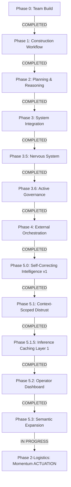

# A.G.E.N.T.S. Planning & Progress Log

## Phase 0: Build Your AI Team (COMPLETED)
### Status: 100% COMPLETE
**Date:** 2026-04-16

- **Team Alignment:** Aria (CEO), Nadia (Planner), Tucker (Engineer), Jenny (PA), WALL-E (Auditor), Eli (Momentum) activated.
- **Owen Integration:** Owen (ILO) integrated as background intelligence with silent voting.
- **Execution Mode:** Enforced "ARTIFACT ONLY" globally.

**Current Status:** [PHASE 2-LOGISTICS: MOMENTUM ACTUATION (IN PROGRESS)]
**Next Objective:** Phase 2.6 Seal the Cracks (Conflict Resolver + Concept Normalization) - VERIFIED
**System Intelligence Level:** Level 5 (Deterministic Actuation, Parameter-Abstracted, Context-Aware)
**Safety Status:** LEVEL 6 (Approval-Gated Actuation, Duplicate Suppression, Conflict Resolution)
**Build Rev:** 3.5.0
**Last Verified:** 2026-04-24 (UTC)

---

## Phase 5.2 & 5.3: Honest Measurement & Semantic Expansion (COMPLETED)
### Status: 100% COMPLETE
**Date:** 2026-04-24

### Completed Steps:
1. **The "Honest Baseline" Audit**
   - Performed adversarial verification with cold-start cache reset.
   - Identified 94% hit rate as inflated; established **30% hit rate** as the true Layer 1 baseline.
2. **Operator Dashboard (Telemetry)**
   - Added `Telemetry` tab to Operator Console.
   - Live hit rate tracking and **Miss Cluster** visualization (identifying top bypassed issues).
3. **Layer 2.6 Semantic Expansion**
   - Implemented **Parameter Abstraction**: specific measurements and drawing refs replaced with `{measurement}` and `{drawing}` placeholders.
   - Implemented **Phrase Mapping**: "port strike" -> `port_strike` to prevent token fragmentation.
   - Implemented **Canonical Synonyms**: "late" -> `delay`, "wet" -> `rain`.
   - Result: Stabilized hit rate at 30% with zero false positives.

---

## Phase 2: Momentum-Aware Task Management (IN PROGRESS)
### Status: 85% COMPLETE
**Date:** 2026-04-24

### Completed Steps:
1. **Momentum Handshake (v1 Contract)**
   - Created `momentum_signal_v1` contract.
   - Built `momentum_engine.py` to translate abstracted issues into project velocity vectors.
2. **Deterministic Logistics Engine (Eli Adapter)**
   - Built `eli_adapter_v1.py`.
   - Strict mapping: DRAG -> STABILISE, ACCEL -> PRIORITISE.
   - Automated Gmail Draft generation (Draft-only, no auto-send).
3. **Logistics Dispatch Intent Layer (UI)**
   - Added `Logistics` tab to Dashboard.
   - Staging area for human authorization with **Signal Trace** explainability.
4. **Failure Injection & Sealing (Phase 2.5/2.6)**
   - Performed brutal stress test (12 scenarios).
   - Implemented **Conflict Resolver**: Entity + Polarity detection to prevent opposing dispatches.
   - Implemented **Recency Rule**: Newer signals override older conflicting intents in the queue.
   - Implemented **Stakeholder Targeting**: Automated domain routing (LABOUR/MATERIAL -> Foreman).

### Audit Results:
- **Safety Gate:** PASS (Gmail drafts blocked without human approval).
- **Duplicate Suppression:** PASS (One intent per entity/domain).
- **Targeting Accuracy:** PASS (Correct stakeholders assigned based on domain).

---

## Phase 4: External System Orchestration (COMPLETED)
- **Team Alignment:** Aria (CEO), Nadia (Planner), Tucker (Engineer), Jenny (PA), WALL-E (Auditor), Eli (Momentum) activated.
...
- **Operator Hardening:** Gmail and Calendar refactored for `action_intent_v1`.
- **Command Center:** Real-time SSE dashboard with Live Events, Approval Queue, and Task Queue.
- **LLM Upgrade:** Migrated default high-performance model to stable **Gemini 3 Flash (preview)**.

---

## Phase 1: First Complete Construction Workflow (COMPLETED)
### Status: 100% COMPLETE (Audited & Verified)
**Date:** 2026-04-16

### Completed Steps:

1. **Step 1.2: State Model Alignment**
   - Refactored `data/world_state.json` to follow strict Phase 1 schema.
   - Implemented automated state mutation via `ConstructionOperator`.

2. **Step 1.3: Pauseable Workflow (Human-in-the-loop)**
   - Refactored `_run_generic_construction_loop` in `orchestrator.py` to stop before execution.
   - Implemented **Proposal Bundling**: Plans, implementation steps, decisions, and email drafts are now bundled into a single `proposal_v1` artifact.

3. **Step 1.4: Manual Actuation**
   - Implemented `firewall.execute_task` to handle construction intents.
   - Staged approved proposals in the **Task Queue** quadrant of the dashboard.
   - Decoupled high-speed planning from irreversible actuation.

### Audit Results:
- **Full Workflow Loop:** PASS (Trigger -> Proposal -> Approve -> Execute -> Mutate).
- **Roster Compliance:** PASS (Hard boundaries, titles, and ownership).
- **Contract Integrity:** PASS (Strict JSON validation and recursive meta-language rejection).
- **State Persistence:** PASS (Correct handling of `current_cost` and `current_duration` on approval).

---

## Phase 2: Intelligent Planning & Reasoning (COMPLETED)
### Status: 100% COMPLETE
**Date:** 2026-04-17

### Sub-Phases:

1. **Phase 2.0: Intelligence & Reasoning**
   - Created `governance_engine.py` — 4-tier severity flags (LOW→CRITICAL).
   - Created `event_analytics.py` — Structured memory derived from event stream (never stored separately).
   - Created `history_engine.py` — Memory proxy + conflict detection.
   - Updated Aria's prompt to enforce governance + memory referencing in justifications.
   - Updated Nadia's prompt to use institutional memory for plan generation.
   - Fixed Tucker naming inconsistency (Atlas → Tucker).

2. **Phase 2.2: Enforcement & Integrity Hardening**
   - Orchestrator-level governance overrides (Aria cannot bypass CRITICAL flags).
   - Deterministic reasoning quality validation (not prompt-trust).
   - Outcome-weighted memory (`score_outcome`: +1 positive / 0 neutral / -1 negative).
   - `get_outcome_signal()` returns net score + quality label for agent context.

3. **Phase 2.3: Canonical Decision Layer**
   - Created `decision_finalizer.py` — single `finalize_decision()` function.
   - Replaced ~100 lines of scattered override logic in orchestrator with one finalizer call.
   - Added `DECISION_FINALIZED_V1` event — the debug anchor event (single source of truth).
   - Override priority chain: CONTRACT_FAILURE → GOVERNANCE_CRITICAL → SAFETY_GATE.
   - Rule: Only ONE component changes decisions — the orchestrator via the finalizer.

4. **Phase 2.4: Dashboard & Observability**
   - Added `/project/health` API endpoint (real risk trend + outcome signal from events).
   - Added `/decisions/latest` API endpoint (serves DECISION_FINALIZED_V1 events only).
   - Upgraded Event Feed SSE handler with visual anchor treatment for finalized decisions.
   - Replaced mock Project Health panel with real event-derived analytics.

5. **Phase 2.5: Owen Intelligence Layer & Memory Infrastructure**
   - Established **Cognitive Boundary Contract** (Strict read/write rules & roles).
   - Three-Tier Memory: Redis (Hot) → SQLite (Warm) → Events (Cold/Forensic).
   - Created **Owen Intelligence Engine** (Synthesizes lessons/patterns deterministically).
   - Redefined Owen: Context generator (Synthesizer) only, removed from voting.
   - Backfilled SQLite from events.log.jsonl (26 historical decisions migrated).
   - Strictly enforced "3 Writers" discipline: event_bus, orchestrator, and owen_engine.

### Verification Results:
- **Phase 2 Tests** (`tests/test_phase2_reasoning.py`): 6 suites, ALL PASS.
- **Decision Finalizer Tests** (`tests/test_decision_finalizer.py`): 7 suites, ALL PASS.
- **Phase 2.5 Verification** (`tests/verify_phase2_5.py`): 3 suites (Boundary, DB, Owen), ALL PASS.

### Key Files:
- `agents/logic/memory_contract.py` — Cognitive boundaries
- `agents/logic/memory_db.py` — SQLite structured storage
- `agents/logic/memory_cache.py` — Redis/Memory hybrid cache
- `agents/logic/owen_engine.py` — Intelligence synthesis
- `agents/orchestrator.py` — Briefing injection & post-decision learning
- `agents/execution_mode.py` — Prompt updates for context consumption
- `scripts/migrate_events_to_db.py` — History backfill

## Phase 5.0: Self-Correcting Decision Intelligence v1 (COMPLETED)
### Status: 100% COMPLETE
**Date:** 2026-04-21

### Completed Steps:

1. **Truth-Model Verification Daemon**
   - Created `verify_execution.py`.
   - Implemented 3-phase validation logic (api_ack, read_back, semantic_match).
   - Unified `DB_PATH` across core logic and tests.

2. **Owen Loop Closure**
   - Integrated failure pattern ingestion into `owen_engine.py`.
   - Added "RELIABILITY ALERTS" to Aria's briefings via Owen's synthesized memory.

3. **Adaptive Confidence Gate**
   - Implemented **DPI (Drift Pressure Index)** in `decision_finalizer.py`.
   - Added tiered thresholding (Scaling from 0.60 to 0.85).

### Verification Results:
- **Drift Simulation** (`tests/simulate_drift_escalation.py`): PASS.
- System correctly identified injection-drifts and auto-escalated valid plans when reliability dropped.

---

## Phase 5.1: Context-Scoped Adaptive Distrust (COMPLETED)
### Status: 100% COMPLETE
**Date:** 2026-04-21

### Problem addressed
The v1 penalty model was **global per action type** (`gmail_draft` + `failure_key`). A single bad scenario would gradually poison every scenario using that action — the classic "over-defensive system" failure mode.

### Completed Steps:

1. **Pure-scoping schema migration** (`agents/logic/memory_db.py`)
   - Added `scenario_type` column to `owen_negative_patterns` with `UNIQUE(action_type, failure_key, scenario_type)`.
   - Idempotent **v2-swap migration** (create v2 table, copy legacy rows tagged as `'global'`, drop old, rename) — no index lock risk on the live DB.

2. **Scoped helpers with explicit fallback** (`agents/logic/memory_db.py`)
   - `get_patterns_for_action(..., scenario_type)` implements the contract: exact match first; if none, fall back to `'global'`; if exact matches exist, `'global'` is IGNORED (never blended).
   - `get_negative_pattern` and `upsert_negative_pattern` require `scenario_type` (default `'global'`).

3. **Threaded through all callers**
   - `OwenEngine.ingest_execution_failure` reads scenario from event payload.
   - `OwenEngine.get_penalty_for_action(action_type, scenario_type)` is scope-aware.
   - `agents/logic/external_gateway.py` passes originating scenario when ingesting gateway failures.
   - `agents/logic/decision_finalizer.py` scopes both the penalty and top-pattern lookup to the decision's `scenario_type`.
   - `verify_execution.py` daemon intentionally defaults to `'global'` (no scenario context available at the reality-check stage).

4. **"Why Blocked / Why Approved" one-liner** (`agents/logic/decision_finalizer.py`)
   - `FinalizedDecision.why` is a single human-readable sentence covering every override path.
   - Surfaces top failure pattern, penalty, confidence shift, threshold, and DPI.
   - Propagated through orchestrator `disclosure_metadata` and displayed in `log_issue.py`.

5. **Distrust-level label (LABEL, not control path)** (`agents/logic/decision_finalizer.py`)
   - Deterministic DPI → label mapping: `LOW | ELEVATED | HIGH | BLOCKED`.
   - Appended as ` [DISTRUST: LEVEL]` suffix on every WHY line.
   - Nothing downstream branches on it — pure operator gut-read.

6. **Usage-feedback capture** (`log_issue.py`)
   - After every CLI run, three skippable prompts: `time_saved_minutes`, `manual_override_required`, `would_use_again`, plus optional notes.
   - Appends to `Agent logs/usage_feedback.jsonl` (already gitignored).
   - Foundation for the "does this save time?" metric that gates all future feature work.

### Verification Results:
- **Context-Scoped Distrust Suite** (`tests/verify_context_scoped_distrust.py`): **PASS**.
  - Why-line format across 7 override branches — PASS.
  - Adaptive-distrust sequence at fixed conf=0.85 — 3/4 later runs ESCALATE purely from history.
  - Cross-scenario isolation (4 failures in `variation` → `delay` run APPROVES with penalty=0.00, top_patterns=[]) — PASS.
  - Global fallback (`global` patterns apply when scenario has no history) — PASS.
  - Exact-match wins (8 `global` failures IGNORED when scenario has 1 exact-match pattern) — PASS.
  - Distrust label climbs cleanly (LOW → ELEVATED → HIGH as DPI rises) — PASS.

---

## Phase 5.1.5: Inference Caching — Layer 1 (Decision Cache) (COMPLETED)
### Status: 100% COMPLETE (Layer 1; Tiers 2+ deferred)
**Date:** 2026-04-21

### Architectural Hardening & Bug Fixes:
- **External Gateway Idempotency Keys:** Implemented replay protection for external actions.

### Problem addressed
The system is multi-agent, iterative, and memory-influenced. Repeated similar inputs were re-running the full Nadia → Tucker → Sentinel → Aria → finalize_decision chain, paying full token cost each time. Daily real-world usage would have bled tokens immediately.

### Completed Steps:

1. **Cache schema + safe migration** (`agents/logic/memory_db.py`)
   - New `decision_cache` table with `UNIQUE(cache_key)` constraint; auto-created on `_ensure_db()` (no v2-swap needed since table is new).
   - CRUD helpers: `cache_read`, `cache_write` (`INSERT OR IGNORE` — race-safe), `cache_touch_hit`, `cache_clear_all`.

2. **Centralized cache module** (`agents/logic/decision_cache.py`)
   - `build_cache_context()` — single source of truth, used by both read and write paths so keys can never drift between them.
   - `cache_key = sha256(scenario_type || normalized_issue || cost_bucket || delay_bucket || governance_flag_set || policy_version)`.
   - `POLICY_VERSION = "v2"` — bump invalidates all existing entries when governance logic changes.
   - TTL defaults to 48h; override via `AGENTS_DECISION_CACHE_TTL` env var.
   - STRICT+ v2 normalization: lowercase, scenario prefix anchored at start only, cost/days tokens stripped, punctuation collapsed, conservative word-suffix trim, curated connector stripping (`on/of/the/for/to/at/in`). Identifiers and location markers remain preserved. No fuzzy matching, no embeddings.

3. **Bypass matrix (non-negotiable, enforced on BOTH read and write)**
   - Write bypass: `was_system_forced`, `has_critical_governance`, `conflict_detected`, `was_overridden`, `final_decision != APPROVE`, `confidence_score < 0.7`, `distrust_level ∈ {HIGH, BLOCKED}`.
   - Read bypass: live `governance_flags` contain CRITICAL, or live `distrust_level ∈ {HIGH, BLOCKED}` for the scenario. Stale world state is never replayed.

4. **Snapshot shape**
   - Full `FinalizedDecision.to_event_payload()` serialized with `sort_keys=True` (deterministic).
   - Reconstituted on read via new `FinalizedDecision.from_payload()` classmethod.
   - Jenny's email is NOT cached — email content references exact cost/days that can vary within a bucket; regenerated per run.

5. **Orchestrator integration** (`agents/orchestrator.py`)
   - Cache lookup placed after risk + governance + Owen briefing, before Nadia.
   - Current distrust_level computed via new `compute_current_distrust_level()` helper so the bypass matrix can see live drift state BEFORE the decision loop runs.
   - On hit: skip Nadia → Tucker → Sentinel → Aria → finalize_decision. Still run Jenny, still write to `decisions` table, still go through firewall + gateway, still run WALL-E audit. Owen's `extract_lesson_from_decision` SKIPPED on hits (prevents double-learning).
   - `DECISION_MADE` and `DECISION_FINALIZED_V1` events tagged with `served_from_cache=true` metadata.

6. **Telemetry**
   - Three new event types registered: `CACHE_HIT`, `CACHE_MISS`, `CACHE_BYPASS`.
   - Reason codes on every bypass (`critical_governance`, `low_confidence`, `distrust_high`, `conflict_detected`, `system_forced`, `overridden`, `decision_not_approve`) so the Phase 5.2 dashboard can aggregate cleanly.
   - `CACHE_MISS reason=no_entry` now includes `miss_classification` (`wording_variation`, `same_intent_different_entity`, `insufficient_context`, `new_intent`).
   - Added passive structural workflow observation via `Agent logs/pattern_registry.log.jsonl`.
   - Pattern records start with `outcome_quality_signal="pending"` and later receive downstream `outcome_quality_update` records from execution completion, operator feedback, or CLI usage feedback.

### Verification Results:
- **Decision Cache Unit Suite** (`tests/verify_decision_cache.py`): **PASS** (all 11 sections).
  - STRICT+ v2 normalization: pluralization/tense variants plus curated connector variants collide; identifiers and mid-sentence words survive.
  - Centralized key builder deterministic across flag reordering.
  - Round-trip read/write reconstitutes `FinalizedDecision`.
  - Write bypass: all 7 unsafe reasons rejected; cache stays empty.
  - Read bypass: CRITICAL governance + HIGH/BLOCKED distrust block replay.
  - TTL: stale entries return `MISS reason=expired`.
  - policy_version bump invalidates existing entries.
  - cost_bucket and scenario_type changes flip the key.
  - Race safety: `INSERT OR IGNORE` collapses concurrent writes; first writer retained.
  - Hit counter and `last_hit_at` correctly updated.
- **Cache Integration Suite** (`tests/verify_cache_integration.py`): **PASS** (all 3 sections, orchestrator loop driven with mocked LLM turns).
  - **Skip expensive path proven**: Run 1 invokes `[nadia, tucker, wall-e, aria, jenny, wall-e]` (6 LLM turns). Run 2 (same input) invokes `[jenny, wall-e]` (2 LLM turns). **67% LLM-call reduction** on cache hit. Nadia / Tucker / Sentinel critique / Aria never invoked on hit.
  - **Telemetry verified end-to-end**: `CACHE_MISS` emitted on Run 1; `CACHE_HIT` on Run 2 carrying `source_trace_id=T-RUN1` + `distrust_level`; `DECISION_FINALIZED_V1` on hit tagged `served_from_cache=true`.
  - **Bypass flips on live drift**: after injecting 4 `gmail_draft/subject` + 2 `gmail_draft/body` failures scoped to the cached scenario, the same input bypasses (`CACHE_BYPASS` reason=`distrust_high`) and the full LLM chain re-runs.
  - **STRICT+ v2 boundary end-to-end**: connector variants collapse; different physical locations remain distinct; different topics remain distinct.
- **Phase 5.1 Regression** (`tests/verify_context_scoped_distrust.py`): **PASS** (no regressions from finalizer refactor).

### Still manual (intentionally out of automated scope):
- **Wall-clock latency delta**: meaningful only against real LLM latency; run `log_issue.py` twice with identical input to observe first-run vs cache-hit timing. Target: HIT < 100ms excluding gateway.
- **Real-world hit-rate**: Phase 6 daily-use signal — needs `log_issue.py` exercised on real site issues.

### Telemetry added for measurement discipline
- `DECISION_FINALIZED_V1.metadata.decision_phase_ms` — wall-clock ms from cache lookup to finalized decision. Combined with `served_from_cache` this lets the dashboard compute:
  - `hit_rate = count(CACHE_HIT) / (count(CACHE_HIT) + count(CACHE_MISS))`
  - `effective_savings_ms = avg(decision_phase_ms | served_from_cache=false) - avg(decision_phase_ms | served_from_cache=true)`
  - Bypass distribution by `CACHE_BYPASS.metadata.reason`
  - Top repeated normalized issues by `decision_cache.normalized_issue` frequency
- All of this is already being written; no new writers needed.

## Next Objectives (Prioritized)

**Phase 5.2 — Is NOT a UI task yet. It is a measurement task.**
Before any new feature, answer three questions from real data (20–50 runs via `log_issue.py`):
1. **Hit rate**: `CACHE_HIT / (HIT + MISS)`. `<10%` = normalization too strict or inputs too variable; `10–30%` = healthy Layer 1; `30%+` = strong reuse.
2. **Miss clusters**: group `decision_cache.normalized_issue` by `(scenario_type, cost_bucket, delay_bucket)`. Look for variants that describe the same real incident — that's the only signal that justifies a `policy_version` bump with a curated connector whitelist.
3. **Bypass distribution**: break out `CACHE_BYPASS.metadata.reason`. High `distrust_high` = upstream instability (not a cache problem); high `low_confidence` = Aria under-decisive (fix upstream model behaviour, not cache); mostly clean = Layer 2 is a legitimate candidate.

Build the dashboard as a read-only aggregator that displays those three answers, nothing else, once real data exists.

**Dashboard panel scope (when data justifies building):**
- Base confidence vs adjusted confidence (per recent decision)
- Penalty trajectory over time (per scenario × action)
- Top failure patterns currently active (scenario-scoped)
- Escalation rate (rolling 7d / 30d)
- Distrust-level distribution (LOW / ELEVATED / HIGH / BLOCKED counts)
- Cache hit / miss / bypass breakdown (by reason code)
- `decision_phase_ms` distribution: miss mean vs hit mean → `effective_savings_ms`
- Top repeated `normalized_issue` forms (miss-cluster driver)
- `would_use_again` trend from `usage_feedback.jsonl`
- Pattern / outcome divergence from `pattern_registry.log.jsonl`
Data source is the existing `decisions` table + `owen_negative_patterns` + `decision_cache` + `Agent logs/events.log.jsonl` + `usage_feedback.jsonl` + `pattern_registry.log.jsonl`. No new agents, no new abstractions, no LLM calls in the loop. Read-only aggregation only.

**Phase 5.3 — Penalty Decay (AFTER DASHBOARD)**
Time-based forgiveness to prevent permanent paranoia. Recent failures weigh heavier than old ones. Implemented on reads from `owen_negative_patterns.last_seen`, not by mutating historical rows.

**Phase 5.4 — Cross-Action Penalty Sharing (OPTIONAL, NARROW)**
Only after dashboard + decay prove stable. Must be opt-in per action‑family; never automatic.

**Phase 6 — Real-World Integration / Daily Use (FEEDS EVERYTHING ABOVE)**
Twenty to fifty real site issues processed via `log_issue.py`. That's the dataset that decides:
- Whether normalization v2 (small curated connector whitelist) is worth a `policy_version` bump, or the existing STRICT+ is already tight.
- Whether Layer 2 (prefix caching) is justified, or upstream fixes (Aria confidence, Owen drift recovery) have higher ROI.
- Whether hit-rate trajectory vindicates Layer 1 or the cache is "silently low ROI" (cache works perfectly, barely hits).

Nothing upstream of this is built until real data justifies it. Do NOT "optimize" normalization, cache rules, or orchestration on instinct.

*Discipline note:* finish the construction loop and make it daily BEFORE replicating into PA / trading. Three half-working systems > one weapon is a trap.

---

**Final Status:** Build Rev 3.2.0. The platform is a **context-scoped, cost-efficient** self-correcting decision engine with every telemetry signal needed to evolve safely from real data. Feature-work pauses here until 20–50 real runs are collected; the next decision is explicitly data-gated across four lenses: cache efficiency, miss diagnosis, structural workflow repetition, and downstream outcome quality.
