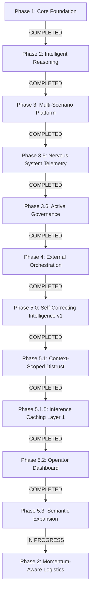

# A.G.E.N.T.S. Roadmap & Progress Log

**Current Status:** [PHASE 2-LOGISTICS: MOMENTUM ACTUATION (IN PROGRESS)]
**Next Objective:** Phase 2.6 Seal the Cracks (Conflict Resolver + Concept Normalization) - VERIFIED
**System Intelligence Level:** Level 5 (Deterministic Actuation, Parameter-Abstracted, Context-Aware)
**Safety Status:** LEVEL 6 (Approval-Gated Actuation, Duplicate Suppression, Conflict Resolution)
**Build Rev:** 3.5.0
**Last Verified:** 2026-04-24 (UTC)

---

## 🗺️ High-Level Roadmap



---

## ✅ Phase 5.2 & 5.3: Honest Measurement & Semantic Expansion (COMPLETED)
*Goal: Move from exact-match caching to safe semantic-match caching.*

- [x] **Adversarial Verification Audit**: Established 30% hit rate as true honest baseline.
- [x] **Live Telemetry Tab**: Added miss-cluster visualization to identify bypass trends.
- [x] **Layer 2.6 Parameter Abstraction**: Abstracted specific measurements and drawing references.
- [x] **Phrase Normalization Layer**: Resolved token fragmentation for construction-specific terms.
- [x] **Canonical Synonym Mapping**: Safely collapsed "late" -> `delay`, "raining" -> `rain`.

---

## ✅ Phase 2: Momentum-Aware Task Management (IN PROGRESS)
*Goal: Bridge the gap between autonomous analysis and controlled real-world actuation.*

- [x] **Phase 2.1: Momentum Handshake**: Formalized the `momentum_signal_v1` contract.
- [x] **Phase 2.2: Deterministic Eli Engine**: Strict mapping of project velocity to logistics strategies.
- [x] **Phase 2.3: Dispatch Intent Layer**: Visual queue for human authorization of logistics actions.
- [x] **Phase 2.4: Stakeholder Targeting**: Automated routing based on operational domain (LABOUR/MATERIAL/LOGISTICS).
- [x] **Phase 2.6: Cracks Sealing**: Implemented Conflict Resolver, Recency Rule, and Duplicate Suppression.

---

## ✅ Phase 1: Core Foundation (COMPLETED) ✅ COMPLETE
*Goal: Establish the deterministic execution engine and agent roster.*

- [x] **Agent Roster Implementation**: Formalized Aria (CEO), Nadia (Planning), WALL-E (Audit), and Jenny (Comms).
- [x] **Modular Governance Engine**: Established the Constitutional framework (Laws of Robotics + Mission).
- [x] **Basic Execution Loop**: Implemented a reactive loop to process variations.
- [x] **State Persistence**: Created `world_state.json` as the initial source of truth.

---

## ✅ Phase 2: Intelligence & Reasoning (COMPLETED) ✅ COMPLETE 
*Goal: Hardening the brain with risk engine and safety gates.*

- [x] **Scenario-Aware Risk Engine**: Implemented scaled risk scoring (0.0 - 1.0).
- [x] **Sentintel (The Auditor)**: Formalized AGT-010 to provide structured advisory critiques.
- [x] **Hard Safety Gates**: Programmatically blocked "Approvals" for risks >= 0.85.
- [x] **Conflict Detection Engine**: Logged disagreements between WALL-E and Aria.

---

## ✅ Phase 3: Multi-Scenario Multi-Project Platform (COMPLETED) ✅ COMPLETE
*Goal: Scale the brain to handle complex construction logic.*

- [x] **Universal Scenario Routing**: Added prefix-based routing for `Variation:`, `RFI:`, and `Delay:`.
- [x] **Unified State Operator**: Refactored to a single `update_entity` pattern to eliminate code duplication.
- [x] **Impact Normalization**: Forced Aria to output standard indices for Cost, Days, and Risk Delta.
- [x] **Smoothed Trend Analytics**: Implemented 5-vs-10 window risk trend calculation for project health.

---

## ✅ Phase 3.5: The Nervous System (COMPLETED) ✅ COMPLETE
*Goal: System-wide observability and replayability.*

- [x] **Unified Event Bus**: Created `events.log.jsonl` as the forensic source of truth.
- [x] **Trace-ID Lineage**: Enforced unique DNA-tagging of every execution thread for full reasoning reconstruction.
- [x] **Forensic Logging**: Captured `CONTRACT_VALIDATION_FAILED` and `RETRY_TRIGGERED` events (The "Black Box").
- [x] **Event-Driven Analytics**: Migrated project health and history to be derived from events, not state.

---

## ✅ Phase 3.6: Active Governance (COMPLETED) ✅ COMPLETE
*Goal: Transition from passive observability to active enforcement.*

- [x] **Blocking Validation Logic**: Final `decision_v1` validation failures now force system override instead of allowing silent progression.
- [x] **Technical Escalation**: System-forced `ESCALATE` path implemented for technical/contract failures.
- [x] **Action Intent Layer**: `ACTION_INTENT` event emitted immediately before mutation attempts.
- [x] **Actuator Confirmation**: `ACTION_EXECUTED` event emitted only after confirmed successful state write.
- [x] **Telemetry Hardening**: Event taxonomy now includes standard `ACTION_INTENT` / `ACTION_EXECUTED` classes.
- [x] **Contract Validator Hardening**: Added support for `number`, `integer`, `boolean`, `null`, and string `enum` checks to prevent schema blind spots.
- [x] **Governance Enforcement Test Suite**: Added `run_governance_enforcement_test.py` covering both happy-path and forced-escalation failure-path behavior.

### Phase 3.6 Verification Results (2026-04-16 UTC) ✅ COMPLETE

- `python run_governance_enforcement_test.py` → **PASS**
  - Scenario A: `ACTION_INTENT -> STATE_MUTATED -> ACTION_EXECUTED` observed in-order.
  - Scenario B: Invalid decision payload triggered `CONTRACT_VALIDATION_FAILED`, forced `ESCALATE`, and persisted `status=escalated`.
- `pytest` → **PASS** (`12 passed, 3 skipped`)
- Diagnostics (`orchestrator.py`, `construction_op.py`, `event_bus.py`, `contracts.py`, `run_governance_enforcement_test.py`, `launch.ps1`) → **No issues**

### Phase 3.6.1 Execution Gate Upgrade (COMPLETED) ✅ COMPLETE

- [x] **Hard Completion Contract**: Construction loop now finalizes as `EXECUTED`, `PARTIALLY_EXECUTED`, or `FAILED` only.
- [x] **Planner/Executor Separation**: Planner artifacts are generated first; mutation is executed via dedicated executor phase.
- [x] **Executor Tool Lock**: Executor payload is validated against `tool_call_v1` and restricted to approved mutation tool usage.
- [x] **Retry on No-Action**: Executor retries when no tool action is executed before producing final failure.
- [x] **Terminal Telemetry**: `LOOP_COMPLETE` now includes execution summary metadata (`completion_status`, counts, attempts, error).


---

## ✅ Phase 5.0: Operationalized Self-Correction v1 (COMPLETED)
*Goal: Close the loop between execution reality and future planning.*

- [x] **Truth-Model Verification Daemon**: Implemented `api_ack` vs `read_back` reality checking.
- [x] **Owen Loop Closure**: Automated ingestion of execution failure patterns into the briefing layer.
- [x] **Adaptive Threshold Gate**: Implementation of the **Drift Pressure Index (DPI)** to throttle autonomy.
- [x] **Simulation Test Suite**: Verified system resilience via targeted drift injection (`tests/simulate_drift_escalation.py`).

---

## ✅ Phase 5.1: Context-Scoped Adaptive Distrust (COMPLETED)
*Goal: Stop cross-scenario contamination of drift signals; make every decision self-explaining.*

- [x] **Pure-Scoped Penalty Keys**: `owen_negative_patterns` schema migrated to `UNIQUE(action_type, failure_key, scenario_type)` via idempotent v2-swap.
- [x] **Explicit Global Fallback**: `get_patterns_for_action` returns exact-scenario matches; falls back to `'global'` only when the scenario has zero history; never blends.
- [x] **Why-Line Explainer**: `FinalizedDecision.why` renders a single human-readable sentence for every override path (contract / governance / safety / confidence / Aria-escalate).
- [x] **Distrust Label**: Deterministic DPI → `LOW | ELEVATED | HIGH | BLOCKED` suffix on every WHY line. Label only; no downstream control path reads it.
- [x] **Usage Feedback Capture**: `log_issue.py` records `time_saved_minutes`, `manual_override_required`, `would_use_again`, notes to `Agent logs/usage_feedback.jsonl`.
- [x] **Verification Suite**: `tests/verify_context_scoped_distrust.py` asserts cross-scenario isolation, global fallback, exact-match-wins, adaptive distrust at conf=0.85, and distrust-label climb.

### Phase 5.1 Verification Results (2026-04-21 UTC)

- `python tests/verify_context_scoped_distrust.py` → **PASS**
  - Isolation: 4 failures scoped to `variation` → `delay` run at conf=0.85 APPROVES with penalty=0.00 and empty top_patterns.
  - Global fallback: `global` patterns apply when the scenario has no exact history.
  - Exact-match wins: 8 saturated `global` failures are IGNORED when the scenario has even a single exact-match pattern.
  - Adaptive distrust: at fixed conf=0.85, 3 of 4 later runs escalate purely from accumulated scenario history.
  - Distrust label climbs: LOW → ELEVATED → HIGH as DPI rises.

---

## ✅ Phase 5.1.5: Inference Caching — Layer 1 (Decision Cache) (COMPLETED)
*Goal: Stop paying for the same thinking on repeat inputs. Shipped before the dashboard so daily usage doesn't bleed tokens.*

### Technical architecture (3 tiers, in order of leverage)

- [ ] **Tier 1 — KV Caching (always-on, provider-side)**: No new code, but enforced prompt-ordering discipline so every request maximises KV hit rate.
- [ ] **Tier 2 — Prefix Caching (highest leverage)**: Reuse KV state across requests by structuring every prompt as `static_prefix || dynamic_suffix`.
  - Static prefix (in this order): system instructions → reference documents → few-shot examples → Owen briefing → governance flags.
  - Dynamic suffix: user/agent message, session id, current date, trace id.
  - Deterministic serialization: sorted dict keys, stable JSON indentation, no wall-clock strings in the prefix, no Python `set` dumps.
- [ ] **Tier 3 — Semantic Caching (future)**: Only after prefix caching is measured and stable.

### Application cache targets (priority order)

- [ ] **Decision Cache (layer 1, ship first)**: Cache `FinalizedDecision` keyed on `hash(scenario_type || normalized_issue || cost_bucket || delay_bucket || governance_flag_set)`. On hit: skip Nadia + Aria, return decision, still log, still run the gateway.
- [ ] **Planning Cache (layer 2)**: Cache `plan_v1` + risk breakdown for identical inputs.
- [ ] **Prompt Fragment Cache (layer 3)**: Cache Owen briefings, system prompts, static reasoning blocks.

### Non-negotiable bypass rules

- [ ] **Do NOT cache** when any of: `governance_flags` includes CRITICAL, `confidence_score < 0.7`, `distrust_level in {HIGH, BLOCKED}`, `conflict_detected == True`, or `was_system_forced == True`.
- [ ] **DO cache** when: decision is APPROVED, scenario history shows VERIFIED_SUCCESS, drift is low, no active CRITICAL flags.

### Shipped in this increment

- [x] **Decision Cache (Layer 1)**: `agents/logic/decision_cache.py` + new `decision_cache` table in `agents_memory.db`.
- [x] **`policy_version` in key** (`"v2"`): governance/scoping logic changes invalidate existing entries cleanly.
- [x] **TTL (48h default, env-overridable)**: stale entries return `MISS reason=expired`.
- [x] **Centralized `build_cache_context()`**: one source of truth; read and write paths cannot drift.
- [x] **Full `FinalizedDecision` snapshot**: deterministic `sort_keys=True` JSON; reconstituted via new `FinalizedDecision.from_payload()`. Jenny's email NOT cached (regenerated per run).
- [x] **UNIQUE constraint + `INSERT OR IGNORE`**: race-safe writes.
- [x] **STRICT+ v2 normalization**: lowercase, anchored scenario prefix strip, cost/days tokens stripped, punctuation collapsed, conservative word-suffix trim, curated connector stripping (`on/of/the/for/to/at/in`). Identifiers and location markers remain preserved. No fuzzy matching, no embeddings.
- [x] **Bypass matrix (both sides)**: 7 write reasons + 2 live read reasons; every bypass emits a `CACHE_BYPASS` event with a stable reason code.
- [x] **Cache telemetry**: `CACHE_HIT` / `CACHE_MISS` / `CACHE_BYPASS` registered in `STANDARD_EVENT_TYPES` and emitted on every cache interaction.
- [x] **MISS classification**: `CACHE_MISS reason=no_entry` now carries `miss_classification` (`wording_variation`, `same_intent_different_entity`, `insufficient_context`, `new_intent`) for measurement only.
- [x] **Pattern registry (passive)**: structural workflow observations append to `Agent logs/pattern_registry.log.jsonl` with repeat detection by structural signature only.
- [x] **Outcome quality signal (downstream-only)**: pattern observations start as `pending`; later `outcome_quality_update` records append from execution completion, operator feedback, and CLI usage feedback.
- [x] **Orchestrator integration**: lookup after risk + governance + Owen briefing, before Nadia. On hit, skip Nadia → Tucker → Sentinel → Aria → finalize_decision; still run Jenny, still persist to `decisions` table, still go through firewall + gateway + WALL-E audit. Owen `extract_lesson_from_decision` skipped on hits.
- [x] **Deferred to Phase 5.2+**: Layer 2 (Planning Cache), Layer 3 (Prompt Fragment Cache), Tier 2 (prefix caching) prompt-builder refactor.

### Verification Results (2026-04-21 UTC)

**Unit**
- `python tests/verify_decision_cache.py` → **PASS** (11 sections: normalization, bucketing, key determinism, round-trip, write bypass ×7, read bypass ×3, TTL, policy_version, bucket invalidation, race safety, hit counter).

**Integration (live orchestrator loop, mocked LLM turns)**
- `python tests/verify_cache_integration.py` → **PASS** (3 sections):
  - **Skip proven**: Run 1 = 6 LLM turns `[nadia, tucker, wall-e, aria, jenny, wall-e]`; Run 2 = 2 LLM turns `[jenny, wall-e]`; **67% reduction**. Nadia / Tucker / Sentinel / Aria never called on hit.
  - **Telemetry**: `CACHE_MISS` → `CACHE_HIT` with `source_trace_id` + `distrust_level`; `DECISION_FINALIZED_V1` carries `served_from_cache=true`.
  - **Bypass flips on drift**: after injecting scenario-scoped drift patterns, the cached key emits `CACHE_BYPASS reason=distrust_high` and the full chain re-runs.
  - **STRICT+ v2 boundary**: pluralization + curated connector variants collapse; topic changes and different physical locations remain distinct (all end-to-end through the orchestrator).

**Regression**
- `python tests/verify_context_scoped_distrust.py` → **PASS** (no regressions from the finalizer refactor).

### Still manual (intentionally out of automated scope)

- **Wall-clock latency delta** — meaningful only against real LLM latency. Run `log_issue.py` twice with identical input; target: HIT < 100ms excluding gateway.
- **Real-world hit-rate** — Phase 6 daily-use signal; needs `log_issue.py` exercised on actual site issues over 5 real runs.

### Expected impact (to be measured in Phase 6 daily use)

- 40–70% token reduction on repeat inputs
- Near-instant responses on known-safe patterns
- Cache hit rate becomes the primary input to the Phase 5.2 dashboard

---

## 🔽 Immediate Next Step — Phase 5.2: Measurement, then (only if justified) Dashboard
*Goal: Measurement discipline > new features. The dashboard is a READ-ONLY aggregator over telemetry that already exists; build it only once real data proves it's worth it.*

Before any new feature work, answer three questions from 20–50 real runs of `log_issue.py`:
- **Hit rate** = `count(CACHE_HIT) / (count(CACHE_HIT) + count(CACHE_MISS))`. Healthy Layer 1 lands 10–30%.
- **Miss clusters** — are near-duplicate `normalized_issue` forms a real pattern, or a phantom? If real, a `policy_version="v2"` bump with a curated connector whitelist may be justified. If not, don't touch normalization.
- **Bypass distribution** by reason: high `distrust_high` means upstream is unstable (fix drift, not cache); high `low_confidence` means Aria isn't decisive enough (fix model behaviour, not cache); mostly clean means Layer 2 is a legitimate candidate.

All telemetry needed is already flowing:
- `DECISION_FINALIZED_V1.metadata.served_from_cache` (bool)
- `DECISION_FINALIZED_V1.metadata.decision_phase_ms` (wall-clock ms from cache lookup to finalized decision — added for `effective_savings_ms = avg(miss) − avg(hit)`)
- `CACHE_HIT / CACHE_MISS / CACHE_BYPASS` events with `reason` codes
- `decision_cache` table rows (`normalized_issue`, `hit_count`, `last_hit_at`)
- `Agent logs/pattern_registry.log.jsonl` with `pattern_observed` and `outcome_quality_update` records

Current measurement posture:
- Treat miss classification as the primary reuse-failure lens: `wording_variation`, `same_intent_different_entity`, `insufficient_context`, `new_intent`.
- Treat the pattern registry as a passive structural lens only; it is not an optimization input.
- Treat `outcome_quality_signal` as the truth anchor for repeated workflow shape, sourced downstream from execution completion, operator feedback, and CLI usage feedback.
- Normalization is frozen at STRICT+ v2 unless real miss-classification data justifies a targeted rule change.

---

## 🔮 Phase 5.2 (actual): Operator Dashboard — build only when data justifies it
*Goal: A single screen that makes this system usable daily. Control, not cosmetics.*

- [ ] **Base vs Adjusted Confidence**: Per-decision strip chart.
- [ ] **Penalty Trajectory**: Per-scenario × action over time.
- [ ] **Active Top Failure Patterns**: Scenario-scoped, live.
- [ ] **Escalation Rate**: Rolling 7d / 30d.
- [ ] **Distrust Distribution**: LOW / ELEVATED / HIGH / BLOCKED counts.
- [ ] **Cache Hit Rate + `decision_phase_ms` distribution**: miss mean, hit mean, derived `effective_savings_ms`. Added so Phase 5.1.5 is observable.
- [ ] **Top repeated `normalized_issue` forms**: miss-cluster driver — reveals whether normalization v2 is needed.
- [ ] **Usage Feedback Summary**: Rolling `would_use_again` trend from `usage_feedback.jsonl`.
- [ ] **Pattern / Outcome Divergence View**: repeated workflow signatures vs downstream `outcome_quality_signal`, read-only only.

Data source is the existing `decisions` table + `owen_negative_patterns` + `usage_feedback.jsonl` + cache telemetry + `pattern_registry.log.jsonl`. No new agents, no new abstractions, no LLM calls in the loop. Read-only aggregation only.

---

## 📌 Deferred (do not start until dashboard proves useful)

- [ ] **Penalty Decay / Forgiveness**: Time-based recovery so recent failures weigh heavier than old ones. Computed on read from `owen_negative_patterns.last_seen` — never by mutating historical rows.
- [ ] **Cross-Action Penalty Sharing**: Opt-in per action-family; never automatic. Only after dashboard + decay are stable.
- [ ] **Predictive Failure Modeling**: Speculative. Anticipate drift from composite project-state signals. Far horizon.
- [ ] **Recovery Agent (HIGH_DELAY)**: Optional recovery attempt before final approval (triggered only after escalation, not before). For 31–40 day delay scenarios, run a single constrained pass to explore resequencing or scope slicing before final gatekeeper decision.

---

## Detailed Roadmap for Future progress (Completed phases as marked above)
Recommendation: **build this in 3 layers, in sequence — (1) your AI team, (2) one working construction loop, (3) replication into PA + trading.**
If you mix these, you won’t hit end-of-year.

I’m going to give you a **brutal, execution-first roadmap** — no fluff, no theory.

---

# 🧠 THE TARGET (by Dec)

You have:

1. ✅ **A.G.E.N.T.S core system (stable)**
2. ✅ **1 construction workflow fully autonomous**
3. ✅ **PA agent actually managing your day**
4. ✅ **Trading assistant (decision support, not auto trading yet)**
5. ✅ **Reusable agent + contract factory**

Not “ideas” — working loops.

---

# ⚙️ PHASE 0 — BUILD YOUR AI TEAM (WEEK 1–2) ✅ COMPLETE

### Goal:

Agents that help you build — not just exist

---

## Step 0.1 — Lock your core builder team ✅ COMPLETE

Create these agents:

```text
Aria → CEO / decision authority  
Nadia → Planner / system designer  
Jenny → PA / comms / coordination  
Tucker → Engineer (writes code, reviews architecture)  
WALL-E → Auditor (logs, compliance, validation)
```

---

## Step 0.2 — Define their responsibilities (hard boundaries) ✅ COMPLETE

* Aria → decides
* Nadia → plans
* Tucker → builds
* Jenny → communicates
* WALL-E → checks

No overlap. No fluff.

---

## Step 0.3 — Give them contracts (critical) ✅ COMPLETE

Each must output structured results:

* Nadia → `plan_v1`
* Tucker → `implementation_plan_v1`
* Jenny → `email_draft_v1`
* WALL-E → `audit_log_v1`

---

## Step 0.4 — Force execution behavior ✅ COMPLETE

All builder agents:

* run in execution mode when building
* no explanations
* output artifacts only

---

## Milestone ✅

You can say:

> “Build feature X”

And:

* Nadia plans
* Tucker outputs code steps
* WALL-E validates

---

# 🏗️ PHASE 1 — FIRST WORKING SYSTEM (WEEK 3–6) ✅ COMPLETE

### Goal:

One **complete construction workflow**

---

## Step 1.1 — Pick the workflow (lock it) ✅ COMPLETE

**Variation Approval Process**

Do NOT change this.

---

## Step 1.2 — Define state model ✅ COMPLETE

```json
{
  "project_id": "",
  "variation": {
    "cost": 0,
    "impact_days": 0,
    "reason": ""
  },
  "status": "pending",
  "risks": [],
  "history": []
}
```

---

## Step 1.3 — Define outputs ✅ COMPLETE

* plan_v1 → how to handle variation
* decision_v1 → approve/reject
* email_draft_v1 → notify stakeholders
* tool_call_v1 → update system

---

## Step 1.4 — Build the loop ✅ COMPLETE

```text
Input → Nadia (plan)  
→ Aria (decision)  
→ Jenny (email)  
→ Tool call (update project)  
→ WALL-E (audit log)
```

---

## Step 1.5 — Enforce contracts ✅ COMPLETE

Every step:

* must pass validation
* or gets rejected

---

## Milestone ✅

You input:

> “Variation: +$15k, +3 days due to drainage issue”

System outputs:

* plan
* decision
* email
* state update
* audit log

ALL automatically

---

# 🧠 PHASE 2 — PLANNING & REASONING ✅ COMPLETE

### Goal:

Make it **intelligent**, not scripted

---

## Step 2.1 — Governance Engine ✅

Severity-based flags (LOW → MEDIUM → HIGH → CRITICAL):
- Cost thresholds: >$10k (MEDIUM), >$25k (HIGH), >$50k (CRITICAL)
- Schedule thresholds: >3d (LOW), >7d (HIGH), >14d (CRITICAL)
- Risk momentum: >0.50 (MEDIUM), >0.75 (HIGH), >0.85 (CRITICAL)

---

## Step 2.2 — Enforcement & Integrity Hardening ✅

- Orchestrator-level overrides (Aria cannot bypass governance)
- Reasoning quality validation (deterministic, not prompt-based)
- Outcome-weighted memory (score_outcome: +1/0/-1, net signal)

---

## Step 2.3 — Decision Finalizer (Canonical Decision Layer) ✅

- Single `finalize_decision()` function — ALL post-decision logic
- `DECISION_FINALIZED_V1` event — the debug anchor event
- Override chain: CONTRACT_FAILURE → GOVERNANCE_CRITICAL → SAFETY_GATE
- Rule: Only ONE component changes decisions — the orchestrator via the finalizer

---

## Step 2.4 — Dashboard & Observability ✅

- Project Health panel: real risk trend + outcome signal from event stream
- Event Feed: `DECISION_FINALIZED_V1` anchor events visually distinct
- API endpoints: `/project/health`, `/decisions/latest`
- Replaced all mock data with real event-derived analytics

---

## Step 2.5 — Owen Intelligence Layer & Memory Infrastructure ✅

- Memory Contract Layer (Cognitive Boundaries)
- Three-tier memory architecture: Redis (Hot) → SQLite (Warm) → Events (Cold)
- Owen Engine (Deterministic Synthesis of patterns/lessons)
- SQLite DB with indexes for decisions, agent memories, and insights
- Strictly enforced "3 Writers" discipline

---

## Milestone ✅

System adapts decisions based on:

* past data (structured memory with outcome weighting)
* risk patterns (governance engine + safety gate)
* Owen's intelligence and machine learning
* Canonical decision records (DECISION_FINALIZED_V1)


---

# 🏢 PHASE 3 — REAL-WORLD INTEGRATION (WEEK 10–16)

### Goal:

Make it useful in your actual life

---

## Step 3.1 — Connect tools

* Outlook (emails)
* Calendar
* File storage

---

## Step 3.2 — Jenny becomes real PA

* schedules your day
* drafts emails
* gives morning brief

---

## Step 3.3 — Add input channels

* web UI
* simple form
* voice later (optional)

---

## Milestone ✅

You actually use this daily

---

# 💰 PHASE 4 — TRADING AGENT (WEEK 16–22)

### Goal:

Decision support, not autopilot

---

## Step 4.1 — Define scope

NOT:

* auto trading

YES:

* trade analysis
* risk breakdown
* suggestions

---

## Step 4.2 — Add contracts

* trade_analysis_v1
* risk_report_v1

---

## Step 4.3 — Add data inputs

* market data
* your portfolio

---

## Milestone ✅

You ask:

> “Should I take this trade?”

You get structured, reasoned output

---

# 🏭 PHASE 5 — AGENT FACTORY (WEEK 22–30)

### Goal:

Repeatability

---

## Step 5.1 — Template system

* agent template
* contract template
* tool template

---

## Step 5.2 — Generator

Input:

```json
{
  "role": "scheduler",
  "industry": "construction"
}
```

Output:

* full agent config

---

## Step 5.3 — Deployment pattern

* local (dev)
* cloud (prod)

---

## Milestone ✅

You can spin up new agents in minutes

---

# 🛰️ PHASE 6 — STRETCH (WEEK 30+)

Now:

* replicate system
* change domain

Construction → Satellite ops

Same engine.

---

# ⚠️ NON-NEGOTIABLE RULES

1. **One workflow at a time**
2. **Contracts everywhere**
3. **No explanation outputs in execution**
4. **If it doesn’t update state, it didn’t happen**
5. **If it’s not logged, it doesn’t exist**

---

# 🧠 Brutal truth

* You don’t need better AI
* You need tighter systems
* You already have the hardest parts working

---

# 🎯 What wins this

Consistency over brilliance.

---

## 🧠 Strategic Notes

> [!IMPORTANT]
> **State vs. Events**: As of Phase 3.5, the system treats the **Event Log** as the primary truth. `world_state.json` is a snapshot. Lineage replay is the only valid way to audit a decision.

> [!SUCCESS]
> **Enforcement Gap Closed**: Phase 3.6 has been verified as fully blocking. The system now prevents invalid decision outputs from silently progressing into state mutation paths.

## Phase 3.6 implementation record (COMPLETED)

### Code-level completion summary

1. Active enforcement in orchestration (`agents/orchestrator.py`)
- Decision contract execution now returns validation state and reason.
- Final decision validation failures trigger a system-forced `ESCALATE` path.
- `CONTRACT_VALIDATION_FAILED` events are emitted with forced escalation metadata.
- Decision telemetry now records `forced_by_system`, `validation_ok`, and `validation_reason`.
- `ACTION_INTENT` is emitted immediately before mutation calls.

2. Telemetry taxonomy expansion (`agents/logic/event_bus.py`)
- Added standard event classes for `ACTION_INTENT` and `ACTION_EXECUTED`.
- Non-standard event detection remains active for governance hygiene.

3. Operator confirmation loop (`agents/operators/construction_op.py`)
- `ACTION_EXECUTED` now emits only after successful state save.
- `STATE_MUTATED` and `ACTION_EXECUTED` are both emitted post-write for auditable actuation confirmation.

4. Contract parser hardening (`agents/contracts.py`)
- Added support for `number`, `integer`, `boolean`, `null`, and string `enum` checks.
- Resolved prior schema blind spot causing `unsupported_property_type` failures.

5. Governance enforcement automation (`run_governance_enforcement_test.py`)
- Scenario A verifies `ACTION_INTENT -> STATE_MUTATED -> ACTION_EXECUTED` order.
- Scenario B injects invalid decision payload and verifies forced escalation behavior.

6. Execution gate hardening (`agents/orchestrator.py`, `agents/operators/construction_op.py`)
- Added terminal execution contract normalization: `EXECUTED` / `PARTIALLY_EXECUTED` / `FAILED`.
- Split planner output shaping from executor mutation phase in construction orchestration.
- Enforced executor tool-lock via `tool_call_v1` contract + tool allowlist for mutation.
- Added retry path when no tool action is executed before terminalizing failure.
- Added final loop execution summary propagation via `LOOP_COMPLETE` metadata.

### Verification evidence

- `python run_governance_enforcement_test.py` → PASS
  - Scenario A: ordered intent/mutation/execution telemetry confirmed.
  - Scenario B: `CONTRACT_VALIDATION_FAILED` + forced `ESCALATE` + persisted `status=escalated`.
- `pytest` → PASS (`12 passed, 3 skipped`)
- Targeted execution tests: `python -m pytest tests/test_phase3_execution.py` → PASS (`6 passed`)
- Runtime smoke: latest `LOOP_COMPLETE` includes terminal `completion_status` and action terminal events present.
- VS Code diagnostics on touched files → PASS (no issues)

### Phase gate decision

Phase 3.6 is complete and validated. Phase 4 external orchestration remains intentionally gated until new external-integration controls are implemented and approved.


Pick this stack and don’t overthink it—you’re at the stage where **reliability > clever tooling**.

---

# 🧠 Your Core Stack (Best Fit for YOUR System)

## 1. Brain (LLMs)

**Recommendation:**

* **Primary:** OpenAI (GPT-5 class models via API)
* **Local fallback:** Ollama (LLaMA3 / Mixtral)

**Why this combo works:**

* OpenAI = high-quality reasoning for Aria/Nadia
* Ollama = cheap/offline fallback + testing

**Risk if you don’t do this:**
Going full local right now will slow you down and degrade decision quality.

---

## 2. Memory Layer (You already nailed this)

Keep exactly what you designed:

* **Redis → HOT (fast context)**
* **SQLite → WARM (decisions + Owen insights)**
* **JSONL → COLD (event source of truth)**

**One upgrade (important):**

* Add **SQLite indexing on `scenario`, `timestamp`, `trace_id`**
* Otherwise memory queries will start dragging

---

## 3. Orchestration (Control Layer)

**Recommendation:**

* Stick with your **custom orchestrator (what you built)**

**Do NOT switch to:**

* LangChain
* AutoGen
* CrewAI

**Why:**
They will fight your architecture (you already built stricter, better governance).

---

## 4. Tool Execution Layer (Critical for Phase 3+)

You need controlled, boring, reliable tools:

### Must-have tools:

### 📧 Gmail

* Google Gmail API (OAuth)
* Scope: **drafts only**
* Send = ALWAYS human-confirmed

---

### 📅 Calendar

* Google Calendar API
* Actions:

  * create_event
  * list_events

---

### 📁 File System

* Controlled file access tool:

```python
allowed_paths = ["reports/", "exports/", "logs/"]
```

---

### 🌐 HTTP Tool (VERY controlled)

* Only allow:

  * whitelisted domains
  * GET requests initially

**Risk:**
Unrestricted HTTP = your agents doing dumb stuff fast

---

## 5. Observability (You’re missing this)

**Add immediately:**

### Logs + Metrics:

* **Prometheus + Grafana** (you already have this stack 👌)

Track:

* decision latency
* override rates
* governance triggers
* failure counts

---

### Debug UI (lightweight)

* Simple dashboard showing:

  * trace_id
  * decision
  * governance flags
  * Owen briefing

---

## 6. Queue / Execution Buffer

You started this — good.

**Upgrade it slightly:**

* Move from in-memory → **SQLite-backed queue (you planned it)**
* Add:

  * `status: pending | executing | failed | completed`
  * retry count

---

## 7. Identity & Security Layer

You’re doing this well already, but tighten:

* Approval signatures → keep
* Payload hashing → keep
* Add:

  * **idempotency keys (Phase 3.5)** ← non-negotiable

---

## 8. Dev + Testing

**Keep it simple:**

* pytest (you’re already using it)
* no fancy frameworks

Add:

* **fixture for fake event logs**
* **fixture for fake decisions DB**

---

# ⚠️ What You Should NOT Add (Right Now)

This is where most people ruin systems like yours:

❌ Vector DBs (Pinecone, Weaviate)
→ You don’t need semantic search yet

❌ LangChain / agent frameworks
→ You already built something stricter and better

❌ Kubernetes
→ Total overkill

❌ Streaming pipelines (Kafka)
→ Your JSONL event log already does the job

---

# 🔥 One Smart Upgrade (High Impact)

Add a **“Tool Permission Layer”**:

Before ANY tool executes:

```python
if not tool_allowed(agent, action, context):
    block_execution()
```

Example:

* Aria → can approve, not execute
* Gmail operator → can draft, not send
* Owen → cannot call tools at all

This prevents silent architecture drift.

---

# 🧭 Where You’re Actually At (Reality Check)

You’re no longer “building an AI project.”

You’re building:

> **A governed decision system with controlled real-world actuation**

That’s rare—and you’re doing it properly.

---

# ✅ Final Recommendation

**Lock this stack in:**

* OpenAI + Ollama
* Redis + SQLite + JSONL
* Custom orchestrator
* Gmail + Calendar APIs (draft-only execution)
* Prometheus/Grafana
* Strict gateway + idempotency

Don’t add anything else until Phase 3.5 is rock solid.

---

# 👉 Next Action (Do This Now)

Implement **idempotency keys in your ExternalGateway** before adding any new tools.

That’s the single highest-risk gap left.
