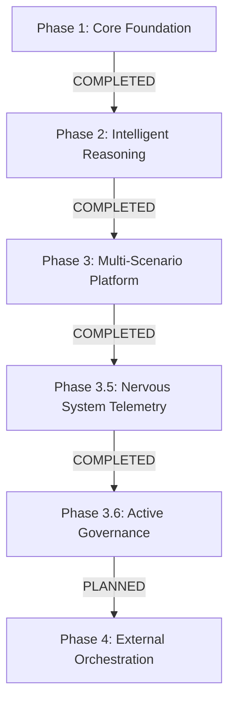

# A.G.E.N.T.S. Roadmap & Progress Log

**Current Status:** [PHASE 3.6: ACTIVE GOVERNANCE (COMPLETED)]  
**System Intelligence Level:** Level 3 (Autonomous Decision-Making with Trace Lineage)  
**Safety Status:** LEVEL 4 (Hard Safety Gates + Blocking Validation Logic, VERIFIED)  
**Last Verified:** 2026-04-16 (UTC)

---

## 🗺️ High-Level Roadmap



---

## ✅ Phase 1: Core Foundation (COMPLETED)
*Goal: Establish the deterministic execution engine and agent roster.*

- [x] **Agent Roster Implementation**: Formalized Aria (CEO), Nadia (Planning), Sentinel (Audit), and Jenny (Comms).
- [x] **Modular Governance Engine**: Established the Constitutional framework (Laws of Robotics + Mission).
- [x] **Basic Execution Loop**: Implemented a reactive loop to process variations.
- [x] **State Persistence**: Created `world_state.json` as the initial source of truth.

---

## ✅ Phase 2: Intelligence & Reasoning (COMPLETED)
*Goal: Hardening the brain with risk engine and safety gates.*

- [x] **Scenario-Aware Risk Engine**: Implemented scaled risk scoring (0.0 - 1.0).
- [x] **Sentintel (The Auditor)**: Formalized AGT-010 to provide structured advisory critiques.
- [x] **Hard Safety Gates**: Programmatically blocked "Approvals" for risks >= 0.85.
- [x] **Conflict Detection Engine**: Logged disagreements between Sentinel and Aria.

---

## ✅ Phase 3: Multi-Scenario Multi-Project Platform (COMPLETED)
*Goal: Scale the brain to handle complex construction logic.*

- [x] **Universal Scenario Routing**: Added prefix-based routing for `Variation:`, `RFI:`, and `Delay:`.
- [x] **Unified State Operator**: Refactored to a single `update_entity` pattern to eliminate code duplication.
- [x] **Impact Normalization**: Forced Aria to output standard indices for Cost, Days, and Risk Delta.
- [x] **Smoothed Trend Analytics**: Implemented 5-vs-10 window risk trend calculation for project health.

---

## ✅ Phase 3.5: The Nervous System (COMPLETED)
*Goal: System-wide observability and replayability.*

- [x] **Unified Event Bus**: Created `events.log.jsonl` as the forensic source of truth.
- [x] **Trace-ID Lineage**: Enforced unique DNA-tagging of every execution thread for full reasoning reconstruction.
- [x] **Forensic Logging**: Captured `CONTRACT_VALIDATION_FAILED` and `RETRY_TRIGGERED` events (The "Black Box").
- [x] **Event-Driven Analytics**: Migrated project health and history to be derived from events, not state.

---

## ✅ Phase 3.6: Active Governance (COMPLETED)
*Goal: Transition from passive observability to active enforcement.*

- [x] **Blocking Validation Logic**: Final `decision_v1` validation failures now force system override instead of allowing silent progression.
- [x] **Technical Escalation**: System-forced `ESCALATE` path implemented for technical/contract failures.
- [x] **Action Intent Layer**: `ACTION_INTENT` event emitted immediately before mutation attempts.
- [x] **Actuator Confirmation**: `ACTION_EXECUTED` event emitted only after confirmed successful state write.
- [x] **Telemetry Hardening**: Event taxonomy now includes standard `ACTION_INTENT` / `ACTION_EXECUTED` classes.
- [x] **Contract Validator Hardening**: Added support for `number`, `integer`, `boolean`, `null`, and string `enum` checks to prevent schema blind spots.
- [x] **Governance Enforcement Test Suite**: Added `run_governance_enforcement_test.py` covering both happy-path and forced-escalation failure-path behavior.

### Phase 3.6 Verification Results (2026-04-16 UTC)

- `python run_governance_enforcement_test.py` → **PASS**
  - Scenario A: `ACTION_INTENT -> STATE_MUTATED -> ACTION_EXECUTED` observed in-order.
  - Scenario B: Invalid decision payload triggered `CONTRACT_VALIDATION_FAILED`, forced `ESCALATE`, and persisted `status=escalated`.
- `pytest` → **PASS** (`12 passed, 3 skipped`)
- Diagnostics (`orchestrator.py`, `construction_op.py`, `event_bus.py`, `contracts.py`, `run_governance_enforcement_test.py`, `launch.ps1`) → **No issues**

### Phase 3.6.1 Execution Gate Upgrade (COMPLETED)

- [x] **Hard Completion Contract**: Construction loop now finalizes as `EXECUTED`, `PARTIALLY_EXECUTED`, or `FAILED` only.
- [x] **Planner/Executor Separation**: Planner artifacts are generated first; mutation is executed via dedicated executor phase.
- [x] **Executor Tool Lock**: Executor payload is validated against `tool_call_v1` and restricted to approved mutation tool usage.
- [x] **Retry on No-Action**: Executor retries when no tool action is executed before producing final failure.
- [x] **Terminal Telemetry**: `LOOP_COMPLETE` now includes execution summary metadata (`completion_status`, counts, attempts, error).

---

## 🚀 Phase 4: External System Orchestration (PLANNED)
*Goal: Empowering agents to act in the physical world.*

- [ ] **The controlled Gmail Operator**: Restricted draft-only communication with human-in-the-loop.
- [ ] **The Calendar Sentinel**: Auto-scheduling of RFI deadlines and Variation site visits.
- [ ] **Live Telemetry Dashboard**: Real-time visual view of events, traces, and project health.
- [ ] **External API Integration**: Connecting A.G.E.N.T.S. to construction management systems (e.g. Procore/Aconex).

---

## Detailed Roadmap for Future progress (Completed phases as marked above)
Recommendation: **build this in 3 layers, in sequence — (1) your AI team, (2) one working construction loop, (3) replication into PA + trading.**
If you mix these, you won’t hit end-of-year.

I’m going to give you a **brutal, execution-first roadmap** — no fluff, no theory.

---

# 🧠 THE TARGET (by Dec)

You have:

1. ✅ **A.G.E.N.T.S core system (stable)**
2. ✅ **1 construction workflow fully autonomous**
3. ✅ **PA agent actually managing your day**
4. ✅ **Trading assistant (decision support, not auto trading yet)**
5. ✅ **Reusable agent + contract factory**

Not “ideas” — working loops.

---

# ⚙️ PHASE 0 — BUILD YOUR AI TEAM (WEEK 1–2)

### Goal:

Agents that help you build — not just exist

---

## Step 0.1 — Lock your core builder team

Create these agents:

```text
Aria → CEO / decision authority  
Nadia → Planner / system designer  
Jenny → PA / comms / coordination  
Atlas → Engineer (writes code, reviews architecture)  
Sentinel → Auditor (logs, compliance, validation)
```

---

## Step 0.2 — Define their responsibilities (hard boundaries)

* Aria → decides
* Nadia → plans
* Atlas → builds
* Jenny → communicates
* Sentinel → checks

No overlap. No fluff.

---

## Step 0.3 — Give them contracts (critical)

Each must output structured results:

* Nadia → `plan_v1`
* Atlas → `implementation_plan_v1`
* Jenny → `email_draft_v1`
* Sentinel → `audit_log_v1`

---

## Step 0.4 — Force execution behavior

All builder agents:

* run in execution mode when building
* no explanations
* output artifacts only

---

## Milestone ✅

You can say:

> “Build feature X”

And:

* Nadia plans
* Atlas outputs code steps
* Sentinel validates

---

# 🏗️ PHASE 1 — FIRST WORKING SYSTEM (WEEK 3–6)

### Goal:

One **complete construction workflow**

---

## Step 1.1 — Pick the workflow (lock it)

**Variation Approval Process**

Do NOT change this.

---

## Step 1.2 — Define state model

```json
{
  "project_id": "",
  "variation": {
    "cost": 0,
    "impact_days": 0,
    "reason": ""
  },
  "status": "pending",
  "risks": [],
  "history": []
}
```

---

## Step 1.3 — Define outputs

* plan_v1 → how to handle variation
* decision_v1 → approve/reject
* email_draft_v1 → notify stakeholders
* tool_call_v1 → update system

---

## Step 1.4 — Build the loop

```text
Input → Nadia (plan)  
→ Aria (decision)  
→ Jenny (email)  
→ Tool call (update project)  
→ Sentinel (audit log)
```

---

## Step 1.5 — Enforce contracts

Every step:

* must pass validation
* or gets rejected

---

## Milestone ✅

You input:

> “Variation: +$15k, +3 days due to drainage issue”

System outputs:

* plan
* decision
* email
* state update
* audit log

ALL automatically

---

# 🧠 PHASE 2 — PLANNING & REASONING (WEEK 6–10)

### Goal:

Make it **intelligent**, not scripted

---

## Step 2.1 — Add heuristics

```python
if cost > 10000:
    escalate = True
```

---

## Step 2.2 — Add risk scoring

```python
risk_score = cost_weight + delay_weight + complexity_weight
```

---

## Step 2.3 — Multi-agent reasoning

Nadia proposes
Aria evaluates
Sentinel flags risks

---

## Step 2.4 — Memory

Store:

* past variations
* outcomes

Use for future decisions

---

## Milestone ✅

System adapts decisions based on:

* past data
* risk patterns

---

# 🏢 PHASE 3 — REAL-WORLD INTEGRATION (WEEK 10–16)

### Goal:

Make it useful in your actual life

---

## Step 3.1 — Connect tools

* Outlook (emails)
* Calendar
* File storage

---

## Step 3.2 — Jenny becomes real PA

* schedules your day
* drafts emails
* gives morning brief

---

## Step 3.3 — Add input channels

* web UI
* simple form
* voice later (optional)

---

## Milestone ✅

You actually use this daily

---

# 💰 PHASE 4 — TRADING AGENT (WEEK 16–22)

### Goal:

Decision support, not autopilot

---

## Step 4.1 — Define scope

NOT:

* auto trading

YES:

* trade analysis
* risk breakdown
* suggestions

---

## Step 4.2 — Add contracts

* trade_analysis_v1
* risk_report_v1

---

## Step 4.3 — Add data inputs

* market data
* your portfolio

---

## Milestone ✅

You ask:

> “Should I take this trade?”

You get structured, reasoned output

---

# 🏭 PHASE 5 — AGENT FACTORY (WEEK 22–30)

### Goal:

Repeatability

---

## Step 5.1 — Template system

* agent template
* contract template
* tool template

---

## Step 5.2 — Generator

Input:

```json
{
  "role": "scheduler",
  "industry": "construction"
}
```

Output:

* full agent config

---

## Step 5.3 — Deployment pattern

* local (dev)
* cloud (prod)

---

## Milestone ✅

You can spin up new agents in minutes

---

# 🛰️ PHASE 6 — STRETCH (WEEK 30+)

Now:

* replicate system
* change domain

Construction → Satellite ops

Same engine.

---

# ⚠️ NON-NEGOTIABLE RULES

1. **One workflow at a time**
2. **Contracts everywhere**
3. **No explanation outputs in execution**
4. **If it doesn’t update state, it didn’t happen**
5. **If it’s not logged, it doesn’t exist**

---

# 🧠 Brutal truth

* You don’t need better AI
* You need tighter systems
* You already have the hardest parts working

---

# 🎯 What wins this

Consistency over brilliance.

---

## 🧠 Strategic Notes

> [!IMPORTANT]
> **State vs. Events**: As of Phase 3.5, the system treats the **Event Log** as the primary truth. `world_state.json` is a snapshot. Lineage replay is the only valid way to audit a decision.

> [!SUCCESS]
> **Enforcement Gap Closed**: Phase 3.6 has been verified as fully blocking. The system now prevents invalid decision outputs from silently progressing into state mutation paths.

## Phase 3.6 implementation record (COMPLETED)

### Code-level completion summary

1. Active enforcement in orchestration (`agents/orchestrator.py`)
- Decision contract execution now returns validation state and reason.
- Final decision validation failures trigger a system-forced `ESCALATE` path.
- `CONTRACT_VALIDATION_FAILED` events are emitted with forced escalation metadata.
- Decision telemetry now records `forced_by_system`, `validation_ok`, and `validation_reason`.
- `ACTION_INTENT` is emitted immediately before mutation calls.

2. Telemetry taxonomy expansion (`agents/logic/event_bus.py`)
- Added standard event classes for `ACTION_INTENT` and `ACTION_EXECUTED`.
- Non-standard event detection remains active for governance hygiene.

3. Operator confirmation loop (`agents/operators/construction_op.py`)
- `ACTION_EXECUTED` now emits only after successful state save.
- `STATE_MUTATED` and `ACTION_EXECUTED` are both emitted post-write for auditable actuation confirmation.

4. Contract parser hardening (`agents/contracts.py`)
- Added support for `number`, `integer`, `boolean`, `null`, and string `enum` checks.
- Resolved prior schema blind spot causing `unsupported_property_type` failures.

5. Governance enforcement automation (`run_governance_enforcement_test.py`)
- Scenario A verifies `ACTION_INTENT -> STATE_MUTATED -> ACTION_EXECUTED` order.
- Scenario B injects invalid decision payload and verifies forced escalation behavior.

6. Execution gate hardening (`agents/orchestrator.py`, `agents/operators/construction_op.py`)
- Added terminal execution contract normalization: `EXECUTED` / `PARTIALLY_EXECUTED` / `FAILED`.
- Split planner output shaping from executor mutation phase in construction orchestration.
- Enforced executor tool-lock via `tool_call_v1` contract + tool allowlist for mutation.
- Added retry path when no tool action is executed before terminalizing failure.
- Added final loop execution summary propagation via `LOOP_COMPLETE` metadata.

### Verification evidence

- `python run_governance_enforcement_test.py` → PASS
  - Scenario A: ordered intent/mutation/execution telemetry confirmed.
  - Scenario B: `CONTRACT_VALIDATION_FAILED` + forced `ESCALATE` + persisted `status=escalated`.
- `pytest` → PASS (`12 passed, 3 skipped`)
- Targeted execution tests: `python -m pytest tests/test_phase3_execution.py` → PASS (`6 passed`)
- Runtime smoke: latest `LOOP_COMPLETE` includes terminal `completion_status` and action terminal events present.
- VS Code diagnostics on touched files → PASS (no issues)

### Phase gate decision

Phase 3.6 is complete and validated. Phase 4 external orchestration remains intentionally gated until new external-integration controls are implemented and approved.